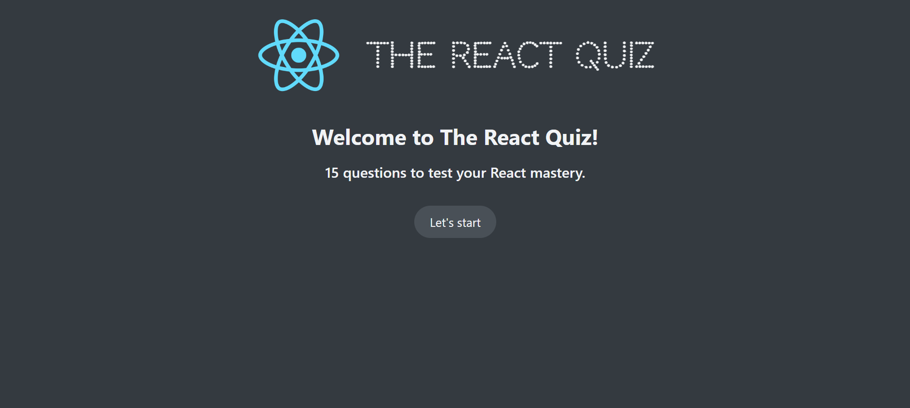
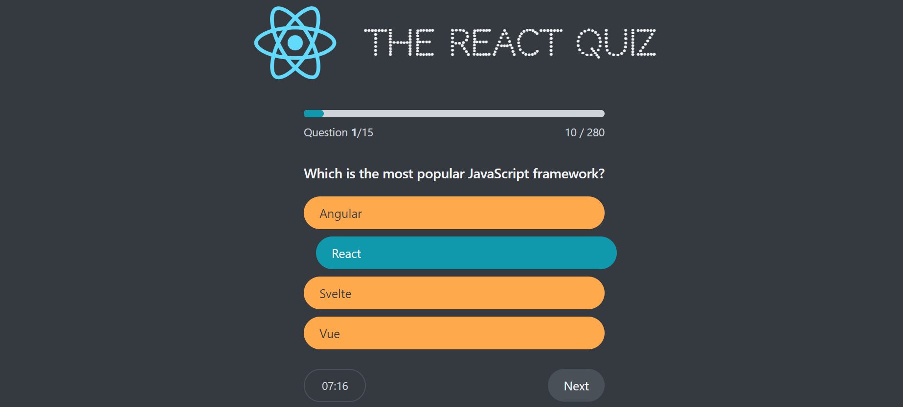
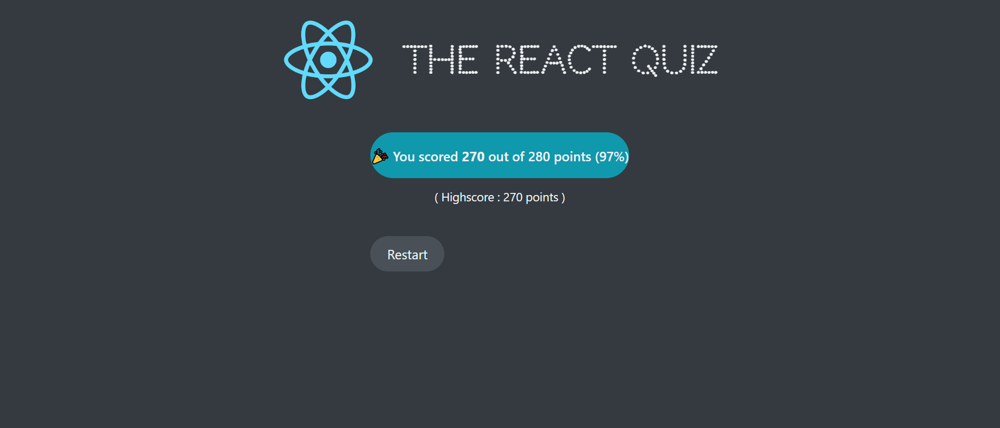

## React Quiz

React Quiz is a react project website which the user can start by clicking Let's start button. When the user start the quiz the timer will execute. Question's order and point will be shown up in the progress bar. After the user answered, the correct answer would be painted to green and user's answer will be moved in + direction of x axis and buttons will be disabled. When the last question gets answered and clicked the finish button, the result of the quiz will be displayed. If the user want to take the test again then they can restart the quiz by clicking the button ▶. You can try by clicking <strong>[ React Quiz ](https://react-quiz-gldn.netlify.app/)</strong>.

## Technologies Used

- HTML
- CSS
- React.js(useState, useEffect, useContext, useReducer)

 

   
   
 
   
   
 
   
   
 

### What did I learn while coding this project?

> #
>
> - _When we have a lot of state variables state variables and state updates, spread across mant event handlers all over the component, updating one piece of state depends on one or multiple other pieces of state, mutiple state updates need to happen at same time we use useReducer hook in React. ,_
> - _useReducer is an alternative way of setting and managing state which is ideal for complex state and for related pieces of state.,_
> - _We call useReducer with a reducer function and its initial state and it returns a state and a dispatch function. Reducer function is where we place all the logic that will be reposnsible for updating the state and all state updating logic from event handlers into this one central place allows us to completely decouple state logic from the component itself which make our component so much cleaner and readable. This reducer function will update the state like setState() function and return new state. Reducer is simply a function that takes in the current state and an action, based on those values returns the next state. State is immutable in React. Reducer is not allow to mutate the state in fact no side effects are allowed in the reducer at all. The reducer function must be a pure function. That always returns a new state based on the current state and current action. The action is simply an object that describe how state should be updated. It usually contains an action type and so-called payload which is basically input data and based on action and payload reducer will determine how to create next state. useReducer function returns dispatch function which is a function that we can use to trigger state updates by sending an action to reducer function and reducer function use this action object to compute the next state. ,_
> - _useState is ideal for single, independent pieces of state and logic to update state is placed directly in event handlers or effects, spread all over one or multiple components. State is updated by calling setState function and state updates are imperative. ,_
> - _useReducer is ideal for multiple related pieces of state and compledx state and logic to update state lives in one central place, decoupled from components: the reducer function. State is updated by dispatching an action to a reducer. state updates are declarative: complex state transitions are mapped to actions. ,_
>
> #
